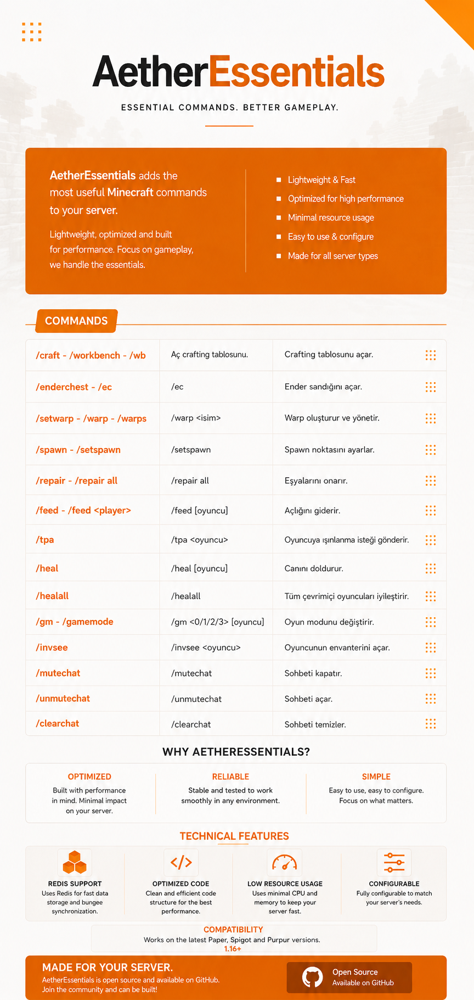

# AetherEssentials

## Permissions

- `aether.command.craft` - Virtual crafting table
- `aether.command.enderchest` - Ender Chest access
- `aether.command.enderchest.others` - Open other players' Ender Chests
- `aether.command.setwarp` - Create warps
- `aether.command.warp` - Teleport to warps
- `aether.command.warps` - View the warp list
- `aether.command.delwarp` - Delete warps
- `aether.command.spawn` - Teleport to spawn
- `aether.command.setspawn` - Set the spawn point
- `aether.command.repair` - Repair held item
- `aether.command.repair.all` - Repair full inventory
- `aether.command.feed` - Feed yourself
- `aether.command.feed.others` - Feed other players
- `aether.command.tpa` - TPA commands
- `aether.command.tpignore` - Ignore teleport requests
- `aether.command.heal` - Heal yourself
- `aether.command.heal.others` - Heal other players
- `aether.command.heal.all` - Heal all online players
- `aether.command.gamemode` - Change your game mode
- `aether.command.gamemode.others` - Change other players' game mode
- `aether.command.invsee` - View other players' inventories
- `aether.command.mutechat` - Disable the chat for everyone
- `aether.command.unmutechat` - Enable the chat for everyone
- `aether.command.clearchat` - Clear the chat for everyone
- `aether.teleport.bypass` - Bypass spawn/warp teleport delay
- `aether.*` - All permissions